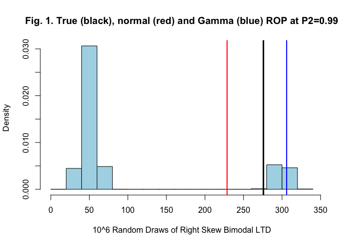

<!-- README.md is generated from README.Rmd. Please edit that file -->

# inventoRy

<!-- badges: start -->
<!-- badges: end -->

The inventoRy package offers nonparametric bootstrap and conventional
parametric approaches for estimating inventory policy decisions such as
the reorder point (ROP) and safety stocks (SS). These functions are for
single item inventories under the continuous review (periodic review
functions are in development) inventory policy using either the cycle
service level (CSL) or fill rate (FR) targets.

The nonparametric bootstrap approach is particularly useful when users
are unsure if the shape of the LTD distributions follows a conventional
parametric form or nonparametric form. Bootstrap works well when
distributions of lead time demand follow non-standard shapes and when
conventional normal and gamma estimates can be biased (Fig. 1). See also
Saldanha et al. 2020 and Saldanha (2022).



### Note

-   There are separate functions that take lead time demand data (LTD)
    as input and independent lead time and demand data as input marked
    as “x” and “ld,” respectively.
-   A demonstration including a limited trial for the FR target with
    user data is available at
    <https://jpsaldanha.shinyapps.io/inventoRy/>

The inventoRy package offers the following approaches for estimating ROP
or SS for the CSL or FR targets:

-   Bootstrap
-   Normal
-   Gamma

In addition, lognormal, truncated normal and Uniform estimation
approaches are provided for the FR targets as featured in Saldanha
(2022)

<!--The goal of inventoRy is to assist in estimate inventory parameters -- reorder point (ROP) and safety stock (ss) -- for the fill rate and service level customer service criterion under the continuous review inventory policy.
The primary purpose of this package is to provide non-paramteric bootstrap estimation functions for cases when the lead time demand (LTD) distribution takes on non-standard forms. Functions for standard forms are also provided including for uniform, lognormal, truncated-normal, etc. as an accompaniment of the Saldanha (2022) article.
-->

# Installation

You can install the latest development version of inventoRy directly
from [GitHub](https://github.com/jpsaldanha/inventoRy) with: –\>

``` r
install.packages("devtools")
devtools::install_github("jpsaldanha/inventoRy")
```

## Examples

Following are simple examples using the bootstrap to estimate:

1.  ROP and SS with LTD for a CSL target

``` r
library("inventoRy")

# Generate a vector of 24 LTD data
x<-runif(24,100,200)

# For a CSL target of 90% probability of no stockouts (PNS)

# ROP
CRboot.x.csl(x,.9)
#> [1] 174.2198

# SS
CRboot.x.csl(x,.9,roptru=FALSE)
#> [1] 21.8229
```

2.  ROP and SS with LTD for a FR target

``` r
library("inventoRy")

# Generate a vector of 24 LTD data
x<-runif(24,100,200)

# For a target FR of 95%. 
# Note for FR we need to specify an order quantity (Q=100) under the continuous review inventory policy.

# ROP
CRboot.x.fr(x,100,.95)
#> [1] 163.9228

# SS
CRboot.x.fr(x,100,.95,roptru=FALSE)
#> [1] 13.16234
```

3.  ROP and SS with independent lead time and demand for a CSL target

``` r
library("inventoRy")

# Generate a vector of 20 lead-time  data
x<-runif(20,2,8)
# Generate a vector of 12 demand  data
y<-runif(12,20,40)

# For a CSL target of PNS = 90%

# ROP
CRboot.ld.csl(x,y,.9)
#> [1] 219.4613

# SS
CRboot.ld.csl(x,y,.9,roptru=FALSE)
#> [1] 51.76902
```

4.  ROP and SS with independent lead time and demand for a FR target

``` r
library("inventoRy")

# Generate a vector of 20 lead-time  data
x<-runif(20,2,8)
# Generate a vector of 12 demand  data
y<-runif(12,20,40)

# For a target FR of 95%. 

# ROP
CRboot.ld.fr(x,y,100,.95)
#> [1] 194.3518

# SS
CRboot.ld.fr(x,y,100,.95,roptru=FALSE)
#> [1] 63.64624
```

## References

-   Saldanha, J.P., 2022. Estimating the reorder point for a fill-rate
    target under a continuous review policy in the presence of
    non-standard lead-time demand distributions. Transportation Research
    Part E: Logistics and Transportation Review,
    doi.org/10.1016/j.tre.2022.102766.
-   Saldanha, J.P., Price, B., Thomas, D.J., 2020. A non–parametric
    approach for setting safety stock levels. SSRN \[online\]. Available
    at: <http://dx.doi.org/10.2139/ssrn.3624998>.
-   Silver, E.A., Pyke, D.F., Thomas, D.J., 2016. Inventory and
    Production Management in Supply Chains. 4th ed. CRC Press, Boca
    Raton, FL.
-   Tyworth, J.E., Guo, Y., Ganeshan, R., 1996. Inventory control under
    gamma demand and random lead time. J. Bus. Logist. 17(1), 291–304.
